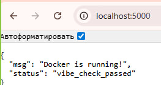
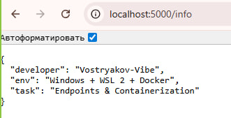
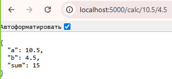

# 🐳 VPe02: Vostryakov-Vibe Docker Session

Проект по контейнеризации микросервиса на Python/Flask. Реализован в связке **Windows + WSL 2 + Docker Desktop**. 

---

## 📋 О проекте
Этот репозиторий содержит изолированное REST API приложение. В обновленной версии v1.3 добавлена оркестрация через **Docker Compose**, что упрощает развертывание и управление контейнером.

### Технологический стэк:
*   **Окружение:** Windows 10/11, WSL 2 (Ubuntu/Debian)
*   **Оркестрация:** Docker Engine & Docker Compose ✅
*   **Язык:** Python 3.9-slim
*   **Фреймворк:** Flask

---

## 🚀 Функционал (Endpoints)

Приложение поддерживает три маршрута:
1.  `GET /` — **Healthcheck**: Проверка статуса сервиса.
2.  `GET /info` — **Developer Info**: Данные о разработчике и среде.
3.  `GET /calc/<float:a>/<float:b>` — **Calculator**: Динамический расчет суммы.

---

## 🛠 Инструкция по запуску

Теперь для управления проектом используется **Docker Compose**.

### 1. Запуск проекта
```bash
docker-compose up -d --build

2. Проверка статуса
bash
docker-compose ps


3. Просмотр логов
bash
docker-compose logs -f


4. Остановка и очистка
bash
docker-compose down


🔗 Проверка работы
После запуска приложение доступно по адресу: http://localhost:5000
Info: http://localhost:5000/info
Calc Example: http://localhost:5000/calc/10.5/4.5
